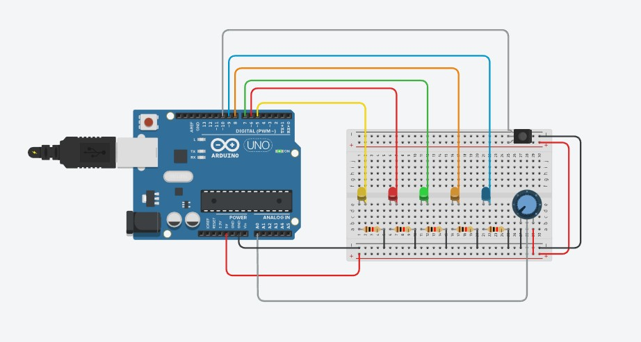

# MorseCode-Arduino

## Project Overview

The Morse Code Project, centered around Arduino development, offers an immersive experience in encoding and decoding messages using BCCode. This project involves visually transmitting messages through LEDs and responding to specific commands.

## Getting Started

### Prerequisites

1. Arduino Board
2. USB Cable
3. Arduino IDE Installed ([Download Arduino IDE](https://www.arduino.cc/en/software))

### Setup

1. Connect your Arduino Board to your computer using the USB Cable.

   

2. Open the Arduino IDE.

3. Load the `morsecode.ino` code into the Arduino IDE.

4. Verify and upload the code to your Arduino Board.

5. Once uploaded, the Arduino Board is ready to interpret and transmit Morse Code!

## Simulating on Tinkercad

You can also simulate the Morse Code Project on Tinkercad. Follow this [Tinkercad Link](https://www.tinkercad.com/things/5XMGK0lY7o6-morse-code) to explore the simulation.

## Project Overview

This Arduino project encodes and decodes messages using BCCode, visually transmitting them through LEDs, and responding to specific commands.

## Project Features

### Encoding and Decoding

Transforms ASCII text into BCCode with precise spacing rules, ensuring optimal representation.

### LED Transmission

Visual representation of messages through LEDs, with user-controlled transmission speed using a potentiometer.

### Command Handling

Four distinct commands are integrated:
- **BxB Command:** Transmit potentiometer value as BCCode.
- **PB Command:** Interpret three decimal digits, determining IR sensor input.
- **BC Command:** Alter brightness of the red LED based on decimal digits.
- **BB Command:** Orchestrate synchronous flashes of LEDs based on specific time units.

## Challenges Addressed

### Spacing Complexity

Robust algorithms manage spacing intricacies within BCCode, ensuring precise rules during encoding and decoding.

### Precise Timing

Utilization of the millis() function facilitates precise control over LED on and off intervals, ensuring accurate and synchronized visual representations.

### Command Interpretation

Dedicated functions handle each command appropriately, ensuring accurate and responsive execution.

---

Embark on the Morse Code adventure with Arduino! 🚀
